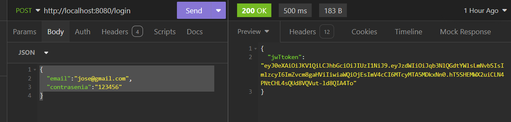
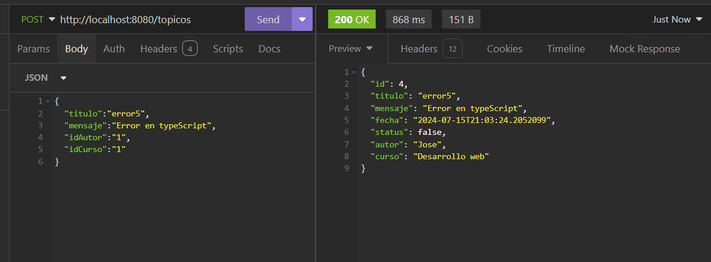
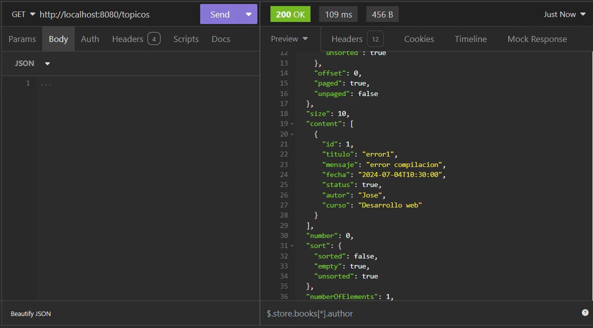
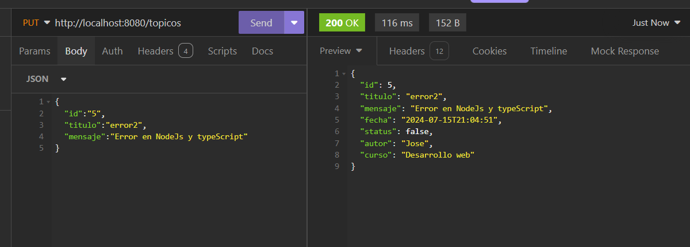
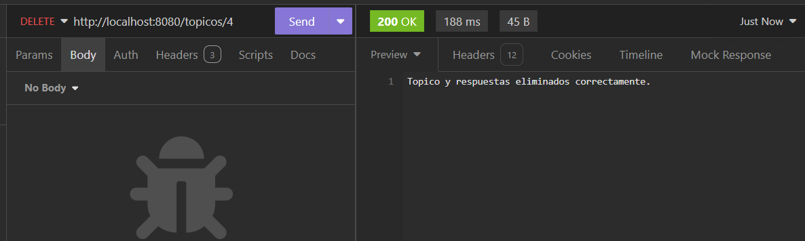

<h1>
  Challenge API Rest <br> Foro Hub  
</h1>


<p>
  La api nos permite realizar operaciones CRUD:
</p>
<ul>
  <li>
    Crear un nuevo tópico.
  </li>
  <li>
    Obtener los tópicos creados,
  </li>
  <li>
    Obtener un tópico específico por el id,
  </li>
  <li>
    Actualizar un tópico;
  </li>
  <li>
    Eliminar un tópico.
  </li>
</ul>


<h2>
  Tecnologias usadas:
</h2>

<ul>
  <li>
    IDE (Entorno de desarrollo integrado) IntelliJ IDEA
  </li>
  <li>
    Java (versión 17) 
  </li>
  <li>
    Maven (versión 4)
  </li>
  <li>
    Spring Boot (versión 3.3.0)
    Dependencias:
      <ul>
        <li>
          Lombok  
        </li>
        <li>
          Spring Web
        </li>
        <li>
          Spring Boot DevTools
        </li>
        <li>
          Spring Data JPA
        </li>
        <li>
          Flyway Migration
        </li>
        <li>
          MySQL Driver
        </li>
        <li>
          Validation
        </li>
        <li>
          Spring Security
        </li>
      </ul>
  </li>
  <li>
    Base de datos: MySQL 8
  </li>
  <li>
    JPA (Java Persistence API)
  </li>
  <li>
    Seguridad: Spring Security
  </li>
  <li>
    Pruebas de API: Insomnia <a>https://insomnia.rest/</a><br>
  </li>
  <li>
    Autenticación: JSON web token <a>https://jwt.io/</a><br>
  </li>
  <li>
    Documentación: SpringDoc y Swagger UI
  </li>
</ul>

<h2>
    Funcionalidad
</h2>


<p>
 1- Autenticación.
</p>



<p>
   2.- Crear topico.
</p>



<p>
   3.- Obtener todos los topicos.
</p>



<p>
    4.-Actualizar topico especifico por id.
</p>



<p>
    5.- Eliminar topico Especifico con sus respuestas.
</p>




## Instalación y Ejecución
1. Clonar el repositorio:
   ```bash
   git clone https://github.com/Sergio-Alba/Foro_Hub.git

2. Navegar al directorio del proyecto:
    ```bash
    cd Foro_Hub

3. Configurar las propiedades de la base de datos en application.properties.

4. Ejecutar la aplicación:

## Uso

2. Autenticarse y obtener un token JWT desde el endpoint /login.
3. Usar el token para acceder a los endpoints protegidos como /topicos.

## Estado del Proyecto

El proyecto se encuentra en estado de finalización con los requisitos básicos completados, incluyendo la autenticación de usuario usando JWT y los endpoints de la ruta /topicos con sus respectivas validaciones de negocio propuestas en el Challenge.


